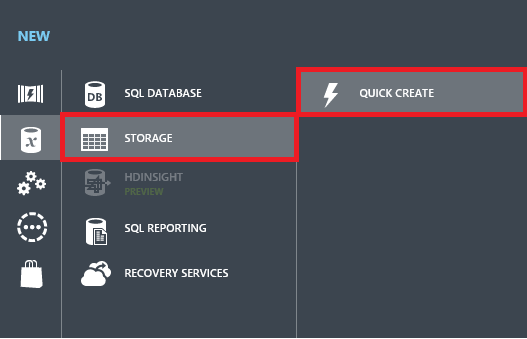
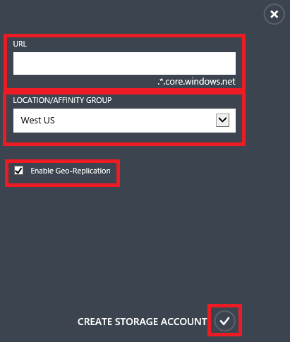

<properties linkid="manage-linux-common-task-upload-vhd" urlDisplayName="Upload a VHD" pageTitle="Create and upload a Linux VHD in Azure" metaKeywords="Azure VHD, uploading Linux VHD" description="Learn to create and upload an Azure virtual hard disk (VHD) that has the Linux operating system." metaCanonical="" services="virtual-machines" documentationCenter="" title="Creating and Uploading a Virtual Hard Disk that Contains the Linux Operating System" authors="kathydav" solutions="" manager="jeffreyg" editor="tysonn" />

# Creating and Uploading a Virtual Hard Disk that Contains the Linux Operating System 

This article shows you how to create and upload a virtual hard disk (VHD) so you can use it as your own image to create virtual machines in Azure. You'll learn how to prepare the operating system so you can use it to create multiple virtual machines based on that image.  

> [WACOM.NOTE] You don't need any experience with Azure VMs to complete the steps in this article. However, you do need an Azure account. You can create a free trial account in just a couple of minutes. For details, see [Create an Azure account](http://www./zh-cn/develop/php/tutorials/create-a-windows-azure-account/). 

A virtual machine in Azure runs the operating system that's based on the image you choose when you create the virtual machine. Your images are stored in VHD format, in .vhd files in a storage account. For more information about disks and images in Azure, see [Manage Disks and Images](http://msdn.microsoft.com/zh-cn/library/windowsazure/jj672979.aspx).

**Note**: When you create a virtual machine, you can customize the operating system settings to facilitate running your application. The configuration that you set is stored on disk for that virtual machine. For instructions, see [How to Create a Custom Virtual Machine](/zh-cn/manage/windows/how-to-guides/custom-create-a-vm/).

**Important**: The Azure platform SLA applies to virtual machines running the Linux OS only when one of the endorsed distributions is used with the configuration details as specified in [this article](http://support.microsoft.com/kb/2805216). All Linux distributions that are provided in the Azure image gallery are endorsed distributions with the required configuration.

##Prerequisites##
This article assumes that you have the following items:

- **A management certificate** - You have created a management certificate for the subscription for which you want to upload a VHD, and exported the certificate to a .cer file. For more information about creating certificates, see [Create a Management Certificate for Azure](http://msdn.microsoft.com/library/windowsazure/gg551722.aspx). 

- **Linux operating system installed in a .vhd file**  - You have installed a supported Linux operating system to a virtual hard disk. Multiple tools exist to create .vhd files, for example you can use a virtualization solution such as Hyper-V to create the .vhd file and install the operating system. For instructions, see [Install the Hyper-V Role and Configure a Virtual Machine](http://technet.microsoft.com/library/hh846766.aspx). 

	**Important**: The newer VHDX format is not supported in Azure. You can convert the disk to VHD format using Hyper-V Manager or the convert-vhd cmdlet.

	For a list of endorsed distributions, see [Linux on Azure-Endorsed Distributions](../linux-endorsed-distributions). Alternatively, see the section at the end of this article for [Information for Non-Endorsed Distributions](../virtual-machines-linux-create-upload-vhd-generic).

- **Linux Azure command-line tool.** If you are using a Linux operating system to create your image, you use this tool to upload the VHD file. To download the tool, see [Azure Command-Line Tools for Linux and Mac](http://go.microsoft.com/fwlink/?LinkID=253691&clcid=0x409).

- **Add-AzureVhd cmdlet**, which is part of the Azure PowerShell module. To download the module, see [Azure Downloads](/zh-cn/develop/downloads/). For reference information, see [Add-AzureVhd](http://msdn.microsoft.com/zh-cn/library/azure/dn495173.aspx).

This task includes the following steps:

- [Step 1: Prepare the image to be uploaded] []
- [Step 2: Create a storage account in Azure] []
- [Step 3: Prepare the connection to Azure] []
- [Step 4: Upload the image to Azure] []

## Step 1: Prepare the image to be uploaded ##

Microsoft Azure supports a variety of Linux distributions (see [Endorsed Distributions](../linux-endorsed-distributions)). The following articles will guide you through how to prepare the various Linux distributions that are supported on Azure:

- **[CentOS-based Distributions](../virtual-machines-linux-create-upload-vhd-centos)**
- **[Oracle Linux](../virtual-machines-linux-create-upload-vhd-oracle)**
- **[SLES & openSUSE](../virtual-machines-linux-create-upload-vhd-suse)**
- **[Ubuntu](../virtual-machines-linux-create-upload-vhd-ubuntu)**
- **[Other - Non-Endorsed Distributions](../virtual-machines-linux-create-upload-vhd-generic)**

After the steps in the guides above you should have a VHD file that is ready to upload into Azure.

## Step 2: Create a storage account in Azure ##

A storage account represents the highest level of the namespace for accessing the storage services and is associated with your Azure subscription. You need a storage account in Azure to upload a .vhd file to Azure that can be used for creating a virtual machine. You can create a storage account by using the Azure Management Portal.

1. Sign in to the Azure Management Portal.

2. On the command bar, click **New**.

	

3. Click **Storage Account**, and then click **Quick Create**.

	

4. Fill out the fields as follows:

	

- Under **URL**, type a subdomain name to use in the URL for the storage account. The entry can contain from 3-24 lowercase letters and numbers. This name becomes the host name within the URL that is used to address Blob, Queue, or Table resources for the subscription.
	
- Choose the location or affinity group for the storage account. By specifying an affinity group, you can co-locate your cloud services in the same data center with your storage.
 
- Decide whether to use geo-replication for the storage account. Geo-replication is turned on by default. This option replicates your data to a secondary location, at no cost to you, so that your storage fails over to a secondary location if a major failure occurs that can't be handled in the primary location. The secondary location is assigned automatically, and can't be changed. If legal requirements or organizational policy requires tighter control over the location of your cloud-based storage, you can turn off geo-replication. However, be aware that if you later turn on geo-replication, you will be charged a one-time data transfer fee to replicate your existing data to the secondary location. Storage services without geo-replication are offered at a discount.

5. Click **Create Storage Account**.

	The account is now listed under **Storage Accounts**.

	

## Step 3: Prepare the connection to Azure ##

Before you can upload a .vhd file, you need to establish a secure connection between your computer and your subscription in Azure. 

1. Open an Azure PowerShell window.

2. Type: 

	`Get-AzurePublishSettingsFile`

	This command opens a browser window and automatically downloads a .publishsettings file that contains information and a certificate for your Azure subscription. 

3. Save the .publishsettings file. 

4. Type:

	`Import-AzurePublishSettingsFile <PathToFile>`

	Where `<PathToFile>` is the full path to the .publishsettings file. 

	For more information, see [Get Started with Azure Cmdlets](http://msdn.microsoft.com/zh-cn/library/azure/jj554332.aspx) 

## Step 4: Upload the image to Azure ##

When you upload the .vhd file, you can place the .vhd file anywhere within your blob storage. In the following command examples, **BlobStorageURL** is the URL for the storage account that you created in Step 2, **YourImagesFolder** is the container within blob storage where you want to store your images. **VHDName** is the label that appears in the Management Portal to identify the virtual hard disk. **PathToVHDFile** is the full path and name of the .vhd file. 

Do one of the following:

- From the Azure PowerShell window you used in the previous step, type:

	`Add-AzureVhd -Destination <BlobStorageURL>/<YourImagesFolder>/<VHDName> -LocalFilePath <PathToVHDFile>`

	For more information, see [Add-AzureVhd](http://msdn.microsoft.com/zh-cn/library/windowsazure/dn205185.aspx).

- Use the Linux command-line tool to upload the image. You can upload an image by using the following command:

		# azure vm image create <image-name> --location <location-of-the-data-center> --OS Linux <source-path-to the vhd>

[Step 1: Prepare the image to be uploaded]: #prepimage
[Step 2: Create a storage account in Azure]: #createstorage
[Step 3: Prepare the connection to Azure]: #connect
[Step 4: Upload the image to Azure]: #upload

